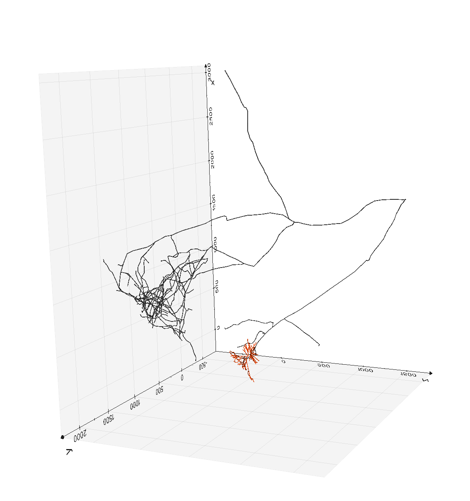

# morphapi

## Overview
Morphapi is a lightweight python package for downloading neurons
morphological reconstructions from publicly available datasets. 

Neuromorph api can be used to download data from the following sources:
  * [Allen brain atlas - Cell Types](https://celltypes.brain-map.org/)
  * [neuromorpho.org](http://neuromorpho.org/)
  * [Janelia Campus - Mouse Light project](https://www.janelia.org/project-team/mouselight)

Neuromorph relies on the [`neurom`](https://zenodo.org/record/209498#.XraWUsZ7l24) package from
the BlueBrain project ([github](https://github.com/BlueBrain/NeuroM)) to reconstruct morphology
from `.swc` files and on [`vedo`](https://github.com/marcomusy/vedo) to create 3d
rendering from morphological data.



## Installation
To install the latest stable build simply use:
```
  pip install morphapi
```

To upgrade:
```
  pip install -U morphapi
```

If you want to get the latest code from the github you can use:
```
    pip install git+https://github.com/brainglobe/morphapi.git
```


## Usage
To see how to use morphapi to **download** neuronal morphological data, head over to the examples
[here](examples/download).

To see how to **visualise** neurons in 3d, have a look [here](examples/visualise).
Keep in mind though that [brainrender](https://github.com/BrancoLab/BrainRender) is the reccomended way to visualise neural morphologies.


## References
* Juan Palacios, lidakanari, Eleftherios Zisis, MikeG, Liesbeth Vanherpe, Jean-Denis Courcol, & Oren Amsalem. (2016, December 19). BlueBrain/NeuroM: v1.2.0 (Version v1.2.0). Zenodo. http://doi.org/10.5281/zenodo.209498
* M. Musy et al. "vedo, a python module for scientific visualization and analysis of 3D objects and point clouds based on VTK (Visualization Toolkit)", Zenodo, 10 February 2019, doi: 10.5281/zenodo.2561402.
*  Winnubst, J. et al. (2019) Reconstruction of 1,000 Projection Neurons Reveals New Cell Types and Organization of Long-Range Connectivity in the Mouse Brain, Cell 179: 268-281
